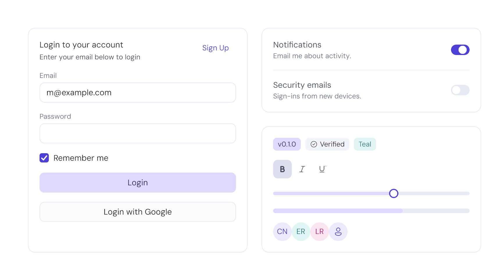
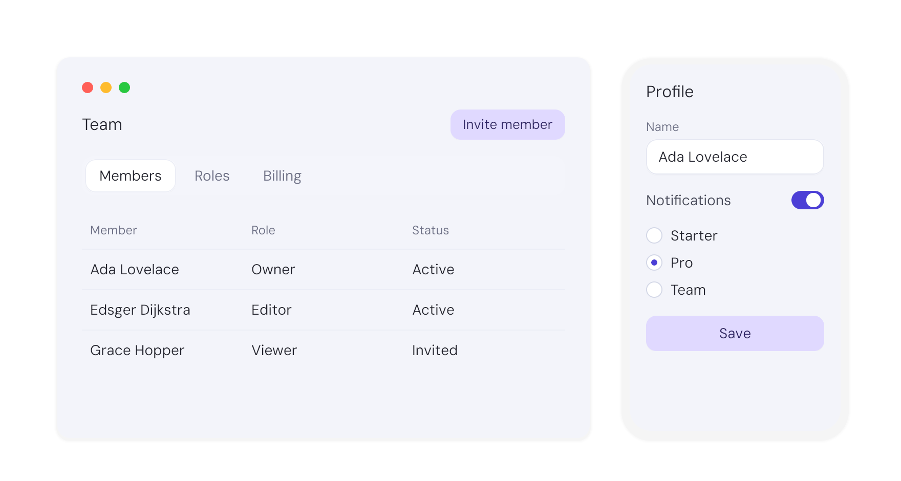
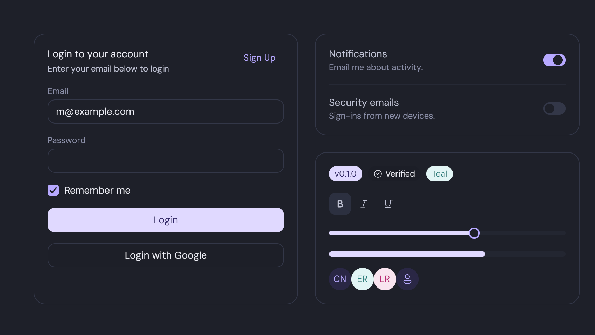
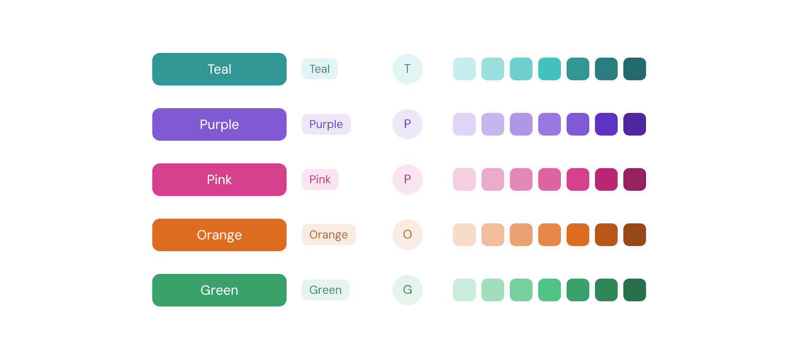

<p align="center">
  
</p>

<h1 align="center">lotusui</h1>

<p align="center"><b>A Go design system for desktop and mobile —
one codebase, native apps. Web when you want it.</b></p>

<p align="center">
  <a href="https://lotusui.com/">Documentation</a> ·
  <a href="CHANGELOG.md">Changelog</a> ·
  <a href="site/PARITY.md">Parity ledger</a>
</p>

&nbsp;



Thirty-plus components with the vocabulary developers already know —
Button, Input, Select, Dialog, DropdownMenu, Tabs, Card, Toast,
Tooltip — implemented natively in Go. No webview, no bindings: one
binary per platform for desktop and mobile. The same module also
compiles to WebAssembly when you want a browser build — which is how
every demo in the documentation is the real component in your browser.
Built on [Gio](https://gioui.org).

```go
import "github.com/ikaito-com/lotusui"

th := lotusui.NewTheme()
lotusui.Button(th, &save, "Save", lotusui.ButtonProps{})
```



## Dark mode is a palette, not a mode

Both themes are built once at startup; following the system
appearance is a pointer swap. Every screenshot in this README is the
same code — only the palette differs.

```go
dark := lotusui.NewTheme(lotusui.WithPalette(lotusui.DefaultDarkPalette))
```



## A color system that can't break

Semantic tokens come in paired fill/ink slots, and per-instance color
is a `ColorScale`: one anchor in, the whole interaction ladder out —
.500 base, .600 hover, .700 pressed. A custom color can never fall
out of step with its own states, because the states are *derived*.

```go
lotusui.Button(th, &go1, "Teal", lotusui.ButtonProps{Color: lotusui.Teal})
lotusui.Badge(th, "Pink", lotusui.BadgeProps{Color: lotusui.Pink})
brand := lotusui.ScaleFrom(myBrandColor) // any color becomes a full scale
```



## Own the code when you need to

The default is the module import. When a component must diverge,
vendor its source into your app — references are auto-qualified by an
AST pass — and keep receiving upstream improvements through a true
three-way merge, with the base reconstructed from the Go module
cache. Your edits, and only your edits, survive as diffs.

```sh
go run github.com/ikaito-com/lotusui/cmd/lotusui add button   # own it
go run github.com/ikaito-com/lotusui/cmd/lotusui update       # merge upstream later
```

## Built for AI-assisted development

- A generated `registry.json` catalogs every component, its files and
  dependencies — machine-readable, consumed by coding agents and the
  CLI, never by app code at runtime.
- The changelog records every API change precisely enough that an
  agent can migrate a consuming app from it alone.
- `lotusui skills` installs agent skill files into your repo, so your
  assistant knows the theming system, the registry and the upgrade
  contract from day one.

## Fast by discipline

Theming resolves once at `NewTheme` — never per frame. Hot paths are
zero-alloc with benchmarks pinning them. The virtualized `ListView`
renders 10,000 rows in ~61µs a frame — about 270× faster than the
naive path. Floating layers (Select, Popover, Tooltip, Toast) ride
Gio's deferred-ops portal: painted last, hit-tested first, zero
bookkeeping.

## Components

Accordion · Alert · AlertDialog · Avatar · Badge · Breadcrumb ·
Button · Card · Checkbox · Dialog · DropdownMenu · Field · Input ·
Pagination · Popover · Progress · RadioGroup · Select · Separator ·
Skeleton · Slider · Spinner · Switch · Table · Tabs · Textarea ·
Toast · Toggle · Tooltip — plus lotusui extensions beyond the web
catalogs: Grid, SimpleGrid, Stack, Split/VSlide, ListView, and the
`Floating` portal primitive.

## Quick start

```sh
go get github.com/ikaito-com/lotusui

# scaffold a minimal themed app with build-time codegen wired in:
go run github.com/ikaito-com/lotusui/cmd/lotusui init

# one brand color → a complete, contrast-checked palette:
go run github.com/ikaito-com/lotusui/cmd/lotusui theme -anchor '#319795' -o theme_gen.go
```

The `lotusui` CLI always runs via `go run`, so its version is locked
to the lotusui in your `go.mod` — nothing to install, and builds
never need the network.

## Development

`make check` (fmt + vet + drift-verify + test) must pass before
committing. The docs site lives in `site/` as a nested module —
consumers of the library never download it. The screenshots above are
captured from the real components (`make -C site media`); they are
regenerated whenever the components change, never mocked.

## License

[MIT](LICENSE) — the same license Gio itself offers, so the whole
stack stays permissive from the toolkit up.
